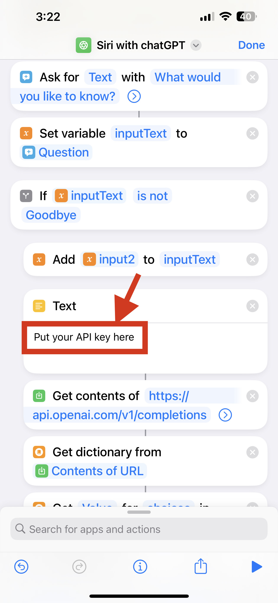

# Access-chatGPT-in-Siri
Siri ChatGPT integration guide. Currently only available on the iPhone and other Apple products that support shortcut commands, and the Android version will be updated soon.
If you find it useful, give it a Star or a fork! Thank you!!

# Create Account/Login Account

When using chatGPT for the first time, go to the official website to create a new account:

click "Sign up" to register an account, and if you have an account already, click "Log in".

It supports most mailboxes for registration.

If you encounter this situation, it means that there are too many active users, just refresh a few times.

After logging in, enter this website to get an API key: https://platform.openai.com/account/api-keys

Log in, click "Create New Security Key", Create an API key

The key will only be displayed once, and only once! ! ! Remember to keep it safe! If the key is not saved in time, you will have to regenerate another one! ! The format of the key should be: sk-xxxxxx. It is best to store it somewhere, so that it can be available at any time in the future.

# Download the shortcut

Added the function of continuing the dialogue without manually clicking; added the "goodbye" interactive conclusion; updated the QA of continuous dialogue display; optimized the problem of text pop-up windows; optimized the problem of format indentation
https://www.icloud.com/shortcuts/948bc7e4db174133886065b0710a245c

Paste your key to the position shown in the picture below ( replace all with your key )

# HowTo Guide

Two input methods:

1. "Hey Siri，Siri with chatGPT", will open up the shortcut ('yes' to all permissions prompt)

2. Just enter your question in the box.

Some phones will encounter text pop-ups. Please use Siri to run the shortcut again, and click Allow all the way until an error is reported. Turn on SmarT Siri again from Shortcuts to use it normally! ! !
